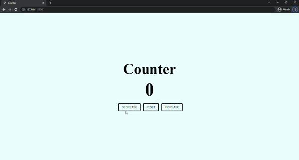

# COUNTER PROJECT

This project includes a counter. When you press the decrease button, the number will decrease. If you press the increase button, the number increases. The color is red when the number is less than 0, and the color is green when the number is greater than 0.